# 🏦 UPay App Clone (Java - Android)

A fully functional clone of the popular UPay mobile app, built using **Java** and **Android Studio** as part of my final project. This clone replicates key financial app features with clean UI, custom tab components, and multi-tab navigation using ViewPager2.

---

## 📱 Features

- ✅ **Splash Screen**
- ✅ **Bottom Navigation Bar (Custom Design)**
- ✅ **ViewPager2 with Nested TabLayouts**
- ✅ **Custom Tab Design (Selected/Unselected UI)**
- ✅ **Transaction History Sections with RecyclerView**
- ✅ **Card-based UI Layouts**
- ✅ **Light & Dark Mode Support**
- ✅ **Clean Architecture with Fragments**
- ✅ **ConstraintLayout-Driven UI**

---

## 📸 Screenshots

|   Splash Screen   |   Home Screen-01  |   Home Screen-02  |
|-------------------|-------------------|-------------------|
| 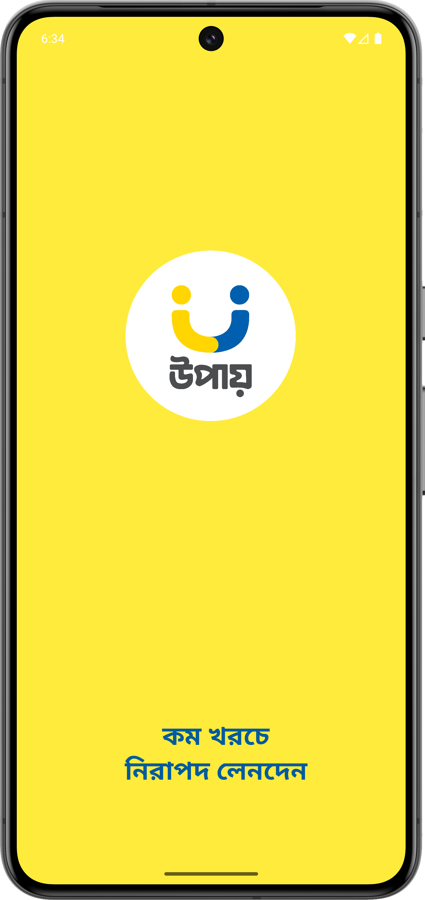 | 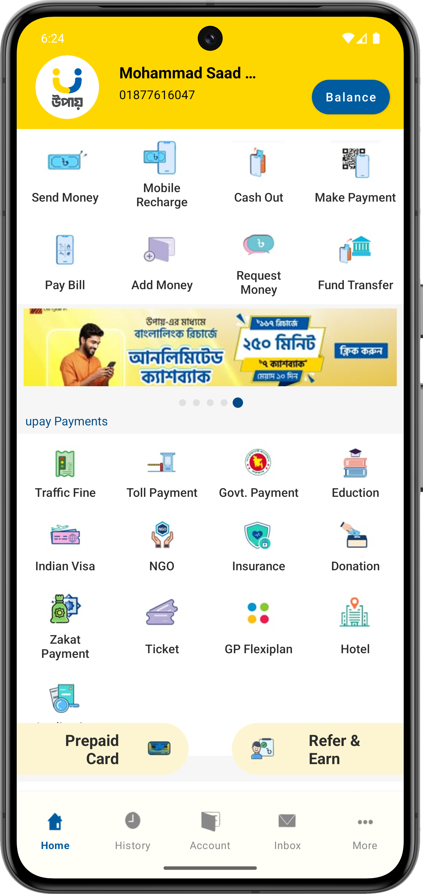 | 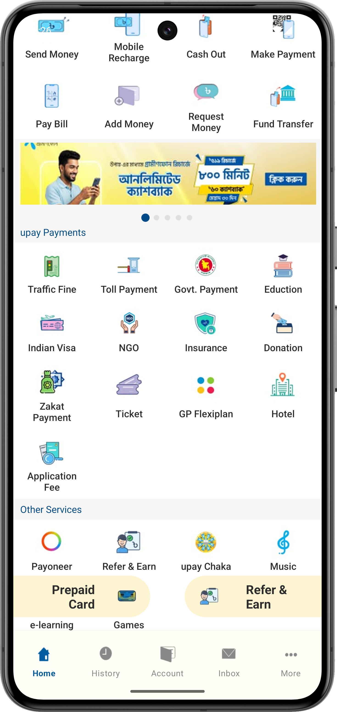 |

|   History Screen-01  |   History Screen-02  |   History Screen-03   |   History Screen-04   |   History Screen-05  |   History Screen-06  | 
|----------------------|----------------------|-----------------------|-----------------------|----------------------|----------------------|
| 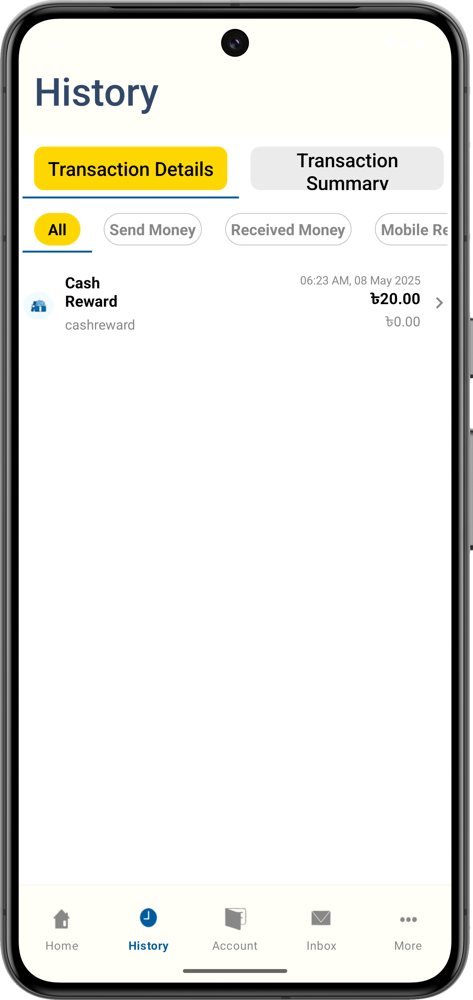 | 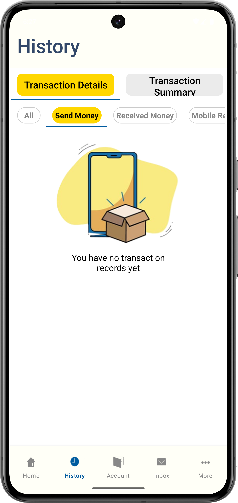 | 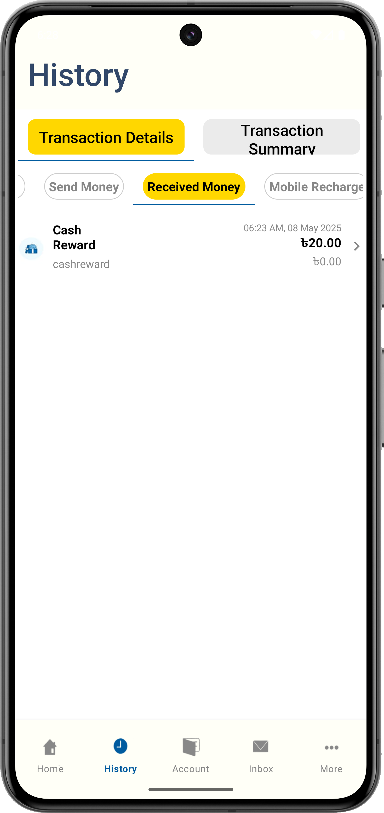 | 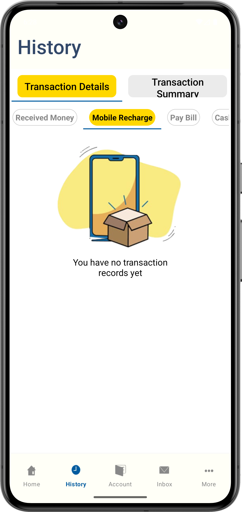 |  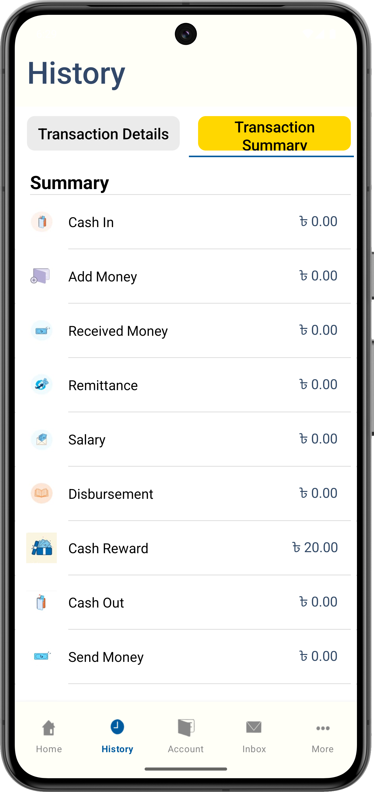 | 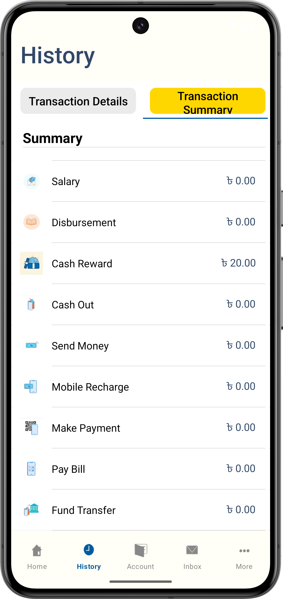 |

|   Account Screen-01   |   Account Screen-02   |
|-----------------------|-----------------------|
| 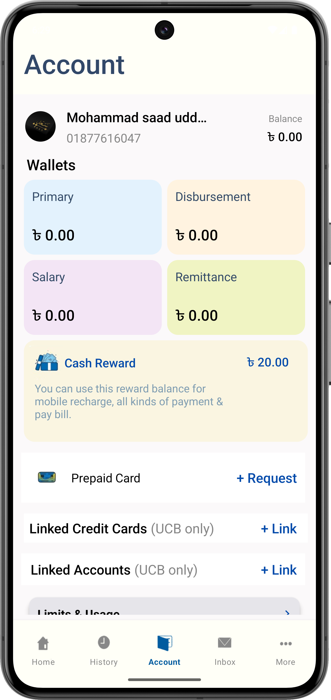 | 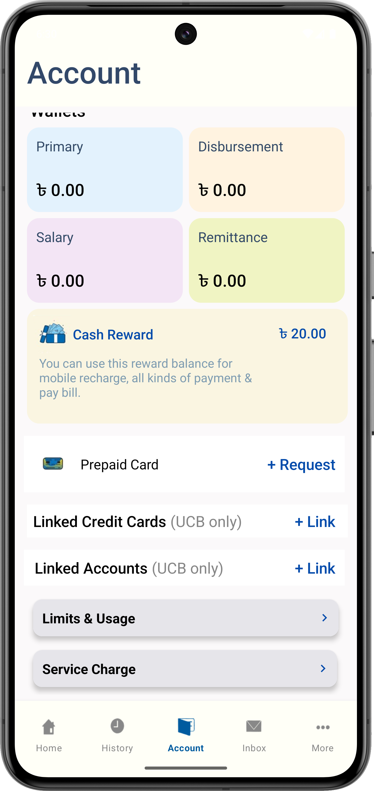 |

|   UPay Offers Screen-01  |   UPay Offers Screen-02  |   UPay Offers Screen-03   |   UPay Offers Screen-04   |   UPay Offers Screen-05  |   UPay Offers Screen-06  |   UPay Offers Screen-07  |
|--------------------------|--------------------------|---------------------------|---------------------------|--------------------------|--------------------------|--------------------------|
|  |  |  |  |   |  |  |

|   More Screen-01   |   More Screen-02   |
|--------------------|--------------------|
| 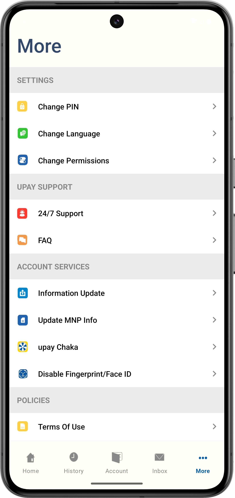 | 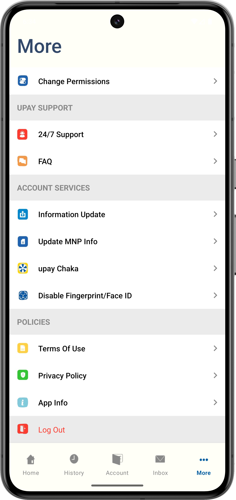 |

---

## 🔧 Tech Stack

- **Language:** Java
- **Framework:** Android SDK
- **UI:** XML with ConstraintLayout
- **Navigation:** Navigation Component (NavGraph)
- **Design:** Material Components

---

## 🎥 Demo Video

[](https://youtu.be/bbUauPiLbo4)

---

## 🚀 Getting Started

### ✅ Prerequisites

- Android Studio Bumblebee (or newer)
- Android device or emulator (API 21+)

### 🔧 Installation Steps

```bash
git clone https://github.com/SaadMahmud-CSE/UI-Clone-App-UPay.git
cd UI-Clone-App-UPay
